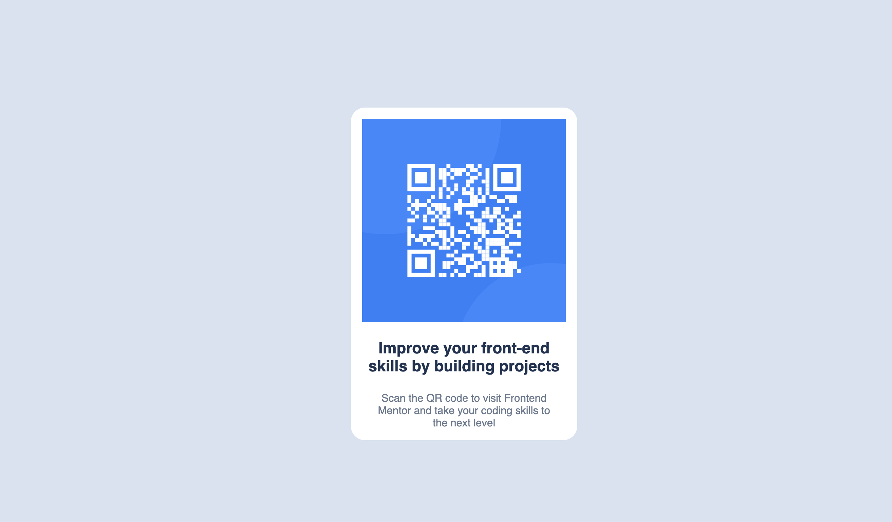
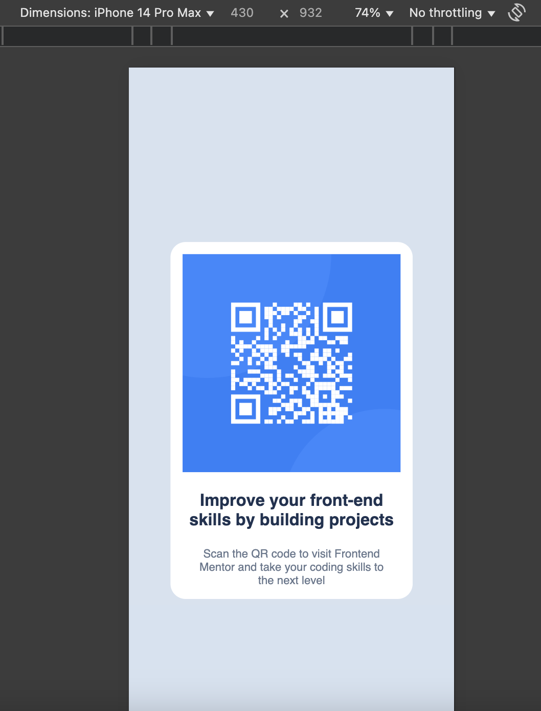

# QR Code Component


## 🚀 Overview

This is a solution to the **QR code component challenge** on [Frontend Mentor](https://www.frontendmentor.io). The goal was to build a simple and responsive QR code card using **HTML** and **CSS**, based on the provided design.

## 🛠️ Built With

- Semantic HTML5
- CSS3 custom properties
- Flexbox for layout
- Responsive design principles

## 📸 Screenshot

| Desktop view | Mobile view |
|--------------|-------------|
|  |  |

## 🧠 What I Learned

While building this project, I reinforced key front-end development concepts such as:

- Structuring clean and semantic HTML
- Creating a centered card layout using `flexbox`
- Using design tokens like variables for colors and fonts
- Building a responsive UI that looks good on both desktop and mobile

## 📁 Folder Structure

QR-CODE-COMPONENT-MAIN/
│
├── design/
│   ├── desktop-design.jpg
│   ├── mobile-design.jpg
│   ├── desktop-design.png
│   └── mobile-design.png
│
├── images/
│   ├── favicon-32x32.png
│   └── image-qr-code.png
│
├── .gitignore
├── index.html
├── preview.jpg
├── README.md
├── README-template.md
├── style-guide.md
└── style.css


## 🚀 Getting Started

To view this project locally:

1. Clone this repository:
   ```bash
   git clone https://github.com/karina-krupodior/QR-CODE-COMPONENT.git
   ```
2. Navigate to the project folder:
   ```bash
   cd qr-code-component
   ```
3. Open `index.html` in your browser.

## 🌐 Live Demo

Check out the live site here: https://karina-krupodior.github.io/QR-CODE-COMPONENT/

## ✍️ Author

- GitHub: https://github.com/karina-krupodior

## 🙌 Acknowledgments

Thanks to [Frontend Mentor](https://www.frontendmentor.io) for the challenge and great resources!

---
